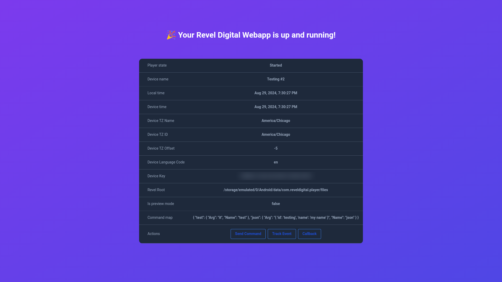

# Example Angular Webapp for Revel Digital

This project was generated with [Angular CLI](https://github.com/angular/angular-cli) version 15.1.6.

## What's a Webapp

A webapp is a self-contained web application which can be deployed to the Revel Digital CMS for use in your digital signage. Webapps are a great option for kiosk applications or for adding more sophisticated dynamic elemnents to your signage.

By utilizing the [Player Client SDK](https://reveldigital.github.io/reveldigital-client-sdk/), Webapps are able to interface with the underlying player software in real-time providing the ability to perform tasks such as event logging, sending commands, and retrieving player specific information.

## Easy deployment with Github Workflows

This example app utilizes Github Workflows to simply the process of building, packaging, and uploading to the Revel Digital CMS. All that's required is an API key from your Revel Digital account and the workflow will handle the deployment for you.

[More information on our Github workflow action here](https://github.com/marketplace/actions/revel-digital-webapp-deploy-action)

## Non-Workflow Deployment

If Workflows are not suitable, you can always deploy your Webapps manually. Simply build your app, then zip the build folder **_(root of the folder must containe the index.html file)_**, and rename the zipfile to have a .webapp extension. Then upload the file as you would any other media item to your Revel Digital account.
